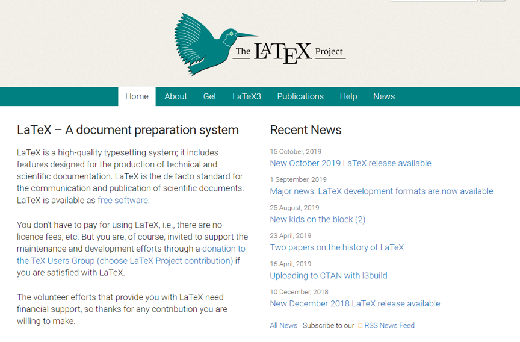
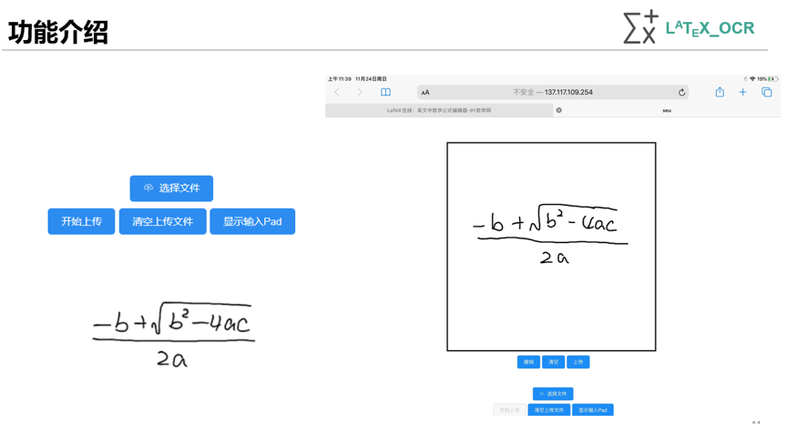

# 项目文档

## 项目背景

Latex是在写论文等文档时广泛使用的工具，能够根据模板语法生成格式美观的文档，特别是数学公式。但它的语法较为复杂，在输入数学公式时更是如此。因此本项目使用深度学习开发了利用OCR识别公式并转换成Latex表达式的工具。

## 技术栈

前端使用Vue，后端基于Flask+Pytorch，使用的Azure GPU服务器训练模型，最后的项目也部署在Azure上。

## 功能简介

本项目主要功能是使用深度学习识别图片中的公式，并转换成Latex表达式。当前已实现了一个简单的web端demo，支持上传图片和在线手写公式，上传到后端识别后返回对应的Latex表达式

（左侧为上传图片，右侧为在线手写）

## 未来展望

目前项目只是一个简单的demo，识别速度和准确率都有待提高。之后团队将致力于优化识别模型以提高准确率，并提高算法性能，加快识别速度。优化web端ui，完善功能，同时推出各终端原生app。
